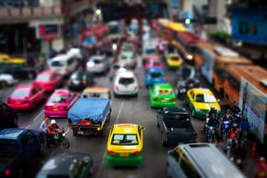

ks-gallery
==========
ks-gallery is a jQuery plugin that transforms your ugly photogallery to a beautiful piece of Flickr-like gallery style =)

Usage
-----
1. Include jquery.ks.js and jquery.ks.css to the head of html template. Don't forget to include jQuery first.
``` html
<link rel="stylesheet" href="jquery.ks.css"/>
<script src="//ajax.googleapis.com/ajax/libs/jquery/1.8.3/jquery.min.js"></script>
<script type="text/javascript" src="jquery.ks.js"></script>
```

2. Add the following markup to your html template where necessary.
``` html
<div class="ks">
    <div data-height="200" data-width="168">
        
    </div>
    <div data-height="200" data-width="267">
        
    </div>
    <div data-height="200" data-width="300">
        
    </div>
    <div data-height="200" data-width="300">
        
    </div>
    <div data-height="200" data-width="134">
        
    </div>
    <div data-height="200" data-width="300">
        
    </div>
</div>
<div id="ks-target"></div>
```

3. In the end of html document, add a piece of code, similar to below (choose one according to your wishes).
    * If you want a fixed gallery, your code will look like this:
``` javascript
$('.ks').ks({
    target: "#ks-target-fixed",
    targetWidth: "600",
    spacing: "10"
});
```

    * For stretching container:
``` javascript
$('.ks').ks({
    target: "#ks-target-stretch",
    spacing: 10
});
```


Supported browsers
------------------
* Chrome
* Firefox
* Opera
* IE8+

Live examples
-------------
* http://yusakh.ru/gallery/
* http://chekhov-book-museum.ru/gallery/